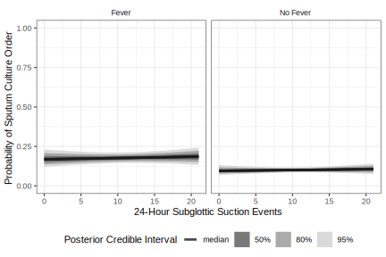

```{r setup, echo=FALSE, eval=TRUE, include=FALSE, autodep=TRUE}

knitr::opts_chunk$set(echo = FALSE, warning = FALSE, message = FALSE)

```

```{r table1, echo=FALSE, eval=TRUE, include=FALSE, autodep=TRUE}

source("./scripts/m_table1.R")


```

```{r survival, echo=FALSE, eval=TRUE, include=FALSE, autodep=TRUE}

source("./scripts/m_survival.R")


```

```{r binomial, echo=FALSE, eval=TRUE, include=FALSE, autodep=TRUE}

source("./scripts/m_binomial.R")


```

```{r ivac_yn, echo=FALSE, eval=TRUE, include=FALSE, autodep=TRUE}

source("./scripts/m_ivac_v_vac_model.R")


```


```{r culture, echo=FALSE, eval=TRUE, include=FALSE, autodep=TRUE}

source("./scripts/m_culture_model.R")


```


  
## Title  
Subglottic suction frequency and adverse events during mechanical ventilation      
  
## Abbreviated Title  
Subglottic suction and ventilator-associated complications  
  
## Authors  
Hatem Abdallah (1), Melanie F. Weingart, MD (3), Risa Fuller, MD (4), David Pegues, MD (1), Rebecca Fitzpatrick, DNP (1), Brendan J. Kelly, MD, MS (1,2)  
  
## Affiliations  
1 - Division of Infectious Diseases, Department of Medicine;  
2 - Department of Biostatistics, Epidemiology, and Informatics;  
Perelman School of Medicine, University of Pennsylvania, Philadelphia, PA;  
3 - Department of Medicine, University of Colorado, Aurora, CO;  
4 - Division of Infectious Disease, Department of Medicine, Icahn School of Medicine at Mount Sinai, New York, NY  
  
## Corresponding Author Contact  
Brendan J. Kelly, MD, MS - brendank@pennmedicine.upenn.edu  
  
## Authors' Contributions  
HA - data analysis, manuscript preparation;  
MFW - data analysis, manuscript preparation;  
RF - data collection, data analysis, manuscript preparation;  
DP - data collection; manuscript preparation;  
RF - data collection; manuscript preparation;  
BJK - data collection; data analysis; manuscript preparation  
  
## Word Count
  
## Acknowledgements  
BJK is supported by the National Institute for Allergy and Infectious Diseases (K23 AI121485 and L30 AI120149), as well as Centers for Disease Control and Prevention (CDC) contract awards (BAA 200-2016-91964 and 200-2018-02919). BJK and DP are supported by the CDC Healthcare-Associated Infection Prevention Epicenters Program (U54CK000485). All authors report no conflicts of interest relevant to this article. There are no relevant disclosures.  
  
## Data Availability  
Deidentified data, as well as analysis scripts and model code are available at github.com/bjklab.  
  
## Keywords  
ventilator-associated complications, ventilator-associated pneumonia, subglottic suction  


-----
\newpage
<P style = "page-break-before: always">
  
## Manuscript  
  
### Abstract  
  
#### Objective  
Tracheal intubation and mechanical ventilation provide essential support for patients with respiratory failure, but the course of mechanical ventilation may be complicated by adverse ventilator-associated events (VAE). VAE may be infection-associated or not. We sought to understand how the frequency of subglottic suction, an indicator of the quantity of sputum produced by ventilated patients, relates to onset of all VAE and infection-associated VAE.  
  
#### Design
We performed a case-crossover study including 87 patients with VAE and evaluated 848 days in the pre-VAE period at risk for VAE.  
  
#### Setting & Participants  
Subjects were recruited from the medical intensive care unit of an academic medical center.  
  
#### Methods  
We used the number of as-needed subglottic suctioning events performed per calendar day to quantify sputum production and compared the immediate pre-VAE period to the preceding period. We used CDC surveillance definitions for VAE and to categorize whether events were infection-associated or not.  
  
#### Results  
Sputum quantity measured by subglottic suction frequency is greater in the period immediately prior to VAE, compared to the preceding period. However, it does not discriminate well between infection-associated VAE and VAE without associated infection.  
  
#### Conclusions  
Subglottic suction frequency may serve as a valuable marker of sputum quantity, and is associated with risk for VAE. However, our results require validation in a broader population of mechanically ventilated patients and intensive care settings.  
  
  

-----  
\newpage
<P style = "page-break-before: always">
  
  
### Introduction  
Tracheal intubation and mechanical ventilation are life-saving interventions to address respiratory failure, but adverse events occur during the course of mechanical ventilation that can result in prolonged critical illness and increased risk of death. Traditional surveillance focused on infectious causes of adverse events, particularly ventilator-associated lower respiratory tract infection (VA-LRTI), including ventilator-associated pneumonia and tracheobronchitis. But other adverse events, such as congestive heart failure or septic shock, can also result in the need for increased ventilator support.  
  
In 2013, the Centers for Disease Control and Prevention (CDC)'s National Healthcare Safety Network (NHSN) implemented a new surveillance strategy for adverse ventilator-associated events (VAE), which advanced a broader, objective definition of ventilator-associated complications (VAC) [@Klompas2013-tj; @Magill2013-kw; @Magill2014-xi]. There are three tiers of VAC: (1) VAC without signs of infection; infection-associated VAC (IVAC), which are accompanied by leukocytosis/leukopenia or fever/hypothermia, as well as altered antibiotic treatment; and (3) possible ventilator-associated pneumonia (PVAP), which are IVAC with sputum studies suggestive of VA-LRTI. The NHSN definitions of VAE are well validated to predict ventilator-associated morbidity and mortality [@Kobayashi2017-ue; @Meagher2019-py; @Klompas2017-bw]. However, current VAE surveillance definitions capture a different population than clinically defined VA-LRTI, which are typically diagnosed by physical examination findings such as sputum production, laboratory test results, radiographic findings, and microbiologic test results [@Fan2016-np; @Klompas2014-uv; @Ramirez-Estrada2018-bf; @Stevens2014-zg; @Klompas2019-tt; @Cocoros2016-md; @Lewis2014-of; @Klompas2015-nj; @Klompas2015-lh; @Rello2019-jl; @Liu2019-fm; @Vaewpanich2019-dr].  
  
Sputum production is a physical examination finding that is often used in the clinical diagnosis of VA-LRTI, but its relationship to VAE defined by CDC NHSN criteria is unknown. It is challenging to quantify sputum production during mechanical ventilation, but an indicator of sputum production is the frequency with which subglottic suction is performed. Subglottic suction is a procedure performed on an as-needed basis by nurses, respiratory therapists, and physicians to clear lower airway secretions via the endotracheal tube and reduce the risk of VA-LRTI [@Damas2015-vx; @Caroff2016-ef; @Mao2016-ys]. We sought to evaluate the relationship between the quantity of sputum produced, measured by the frequency of subglottic suctioning, and VAE. Specifically, we sought to define how subglottic suction frequency in the immediate pre-VAE period relates to subglottic suction frequency in the preceding period, and to define whether sputum quantity measured by subglottic suction frequency discriminates between VAC and IVAC/VAP. Here we report the results of a case-crossover study designed to address these questions.   
  
  
  
-----  
\newpage
<P style = "page-break-before: always">
  
### Materials & Methods  
#### Study Design  
We performed a case-crossover study to define the relationship between the quantity of sputum production (primary exposure), measured as the frequency with which nurses and respiratory therapists chose to perform as-needed subglottic suctioning, and the occurrence of VAE (primary outcome). We also analyzed whether VAE were categorized as VAC without suspected infection or as IVAC/PVAP. For the primary analysis, the day of VAE served as the case period. The days prior to VAE during which subjects could have been diagnosed with VAE (i.e., after at least two days of stable or decreasing positive end-expiratory pressure (PEEP) and fraction of inspired oxygen (FiO2) requirements) served as the control period.   
  
#### Study Setting    
We evaluated 90 consecutive VAE that occurred across 87 unique subjects, over 3.5 years in the medical intensive care unit (MICU) of the Hospital of the University of Pennsylvania (HUP), a tertiary academic medical center. All patients who depend on mechanical ventilation at HUP were monitored for VAE, and all VAE were reported to NHSN. VAC and IVAC were captured by review of HUP NHSN reporting records. The study was approved by the University of Pennsylvania Institutional Review Board (protocol #824613) with a waiver of informed consent.  
  
#### Study Population  
Subjects were eligible for inclusion if they had been admitted to the HUP MICU, required mechanical ventilation for a period greater than two calendar days (i.e., at risk for VAE), and experienced a VAE event within the enrollment period.    
  
#### Clinical Data Collection  
VAE dates and VAC versus IVAC categorization were obtained from NSHN reporting records. Subject demographics, medical diagnoses, laboratory, and microbiology data were obtained from the Penn Data Store, a repository of electronic health record data. Subglottic suction events were extracted from daily flowsheets that report all activity related to mechanical ventilation.       
  
#### Definition of Exposures  
The primary exposure was the quantity of sputum production, defined as number of as-needed subglottic suction events performed per calendar day. Calendar days were used because VAE (outcome of interest) are adjudicated per calendar day.     
  
#### Definition of Outcomes  
The primary outcome was VAE, and we compared the frequency of subglottic suction on the day of VAE and in the preceding 48 hours to the pre-VAE period. To evaluate whether quantity of sputum discriminates between VAC and IVAC, we similarly compared subglottic suction frequency across VAE categories.  
  
#### Precision and Sample Size  
We determined the necessary sample size by specifying the desired precision with which to detect the effect of sputum quantity to discriminate the pre-VAE and VAE risk periods [@Rothman2018-jg]. We anticipated that with 85 subjects we could detect an absolute risk difference attributable to sputum quantity of 15% with posterior certainty 4% - 26%. With the same subject number, we anticipated detecting a 25% absolute risk of IVAC versus VAC attributable to sputum quantity, with 95% posterior certainty 4 - 45%.  
  
#### Statistical Methods and Models  
We organized data with R statistical software version 3.6.1 and generated plots using the “ggplot2” package [@R_Core_Team2018-xo]. We evaluated potential confounders by comparing clinical variables of interest across exposure groups (high versus low frequency of subglottic suction at onset of mechanical ventilation) using Wilcoxon rank-sum testing (continuous variables) and Fisher’s exact test (categorical variables). For the primary analysis, we performed Bayesian multilevel logistic regression with random, subject-level slopes and intercepts. Like like conditional logistic regression, this approach accounts for subject-level strata in the case-crossover design [@Maclure1991-kj; @Maclure2000-cx; @Hosmer2013-xj; @Rice2008-lo]. To permit partial pooling of parameter estimates and rigorous evaluation of model fit, Bayesian models were fit using Stan Hamiltonian Monte Carlo (HMC) version 2.19 via the "rethinking", "rstan", and "brms" packages [@Burkner2017-yr; @Carpenter2017-ec; @McElreath2016-sf]. Models were fit with 4 chains of 2000 iterations, then confirmed with HMC diagnostics (no divergent iterations, no iterations saturating maximum tree depth, Rhat statistic < 1.1 for all parameters, and E-BFMI > 0.2), and by examining the posterior distributions [@Gabry2019-le]. We characterized posterior credibility intervals and type S error [@Gelman2000-ih].          
  
#### Availability of Data  
Data, model code, and code used to produce the figures are available at https://github.com/bjklab/Subglottic-suction-frequency-and-adverse-events-during-mechanical-ventilation.  
  
  
  
-----  
\newpage
<P style = "page-break-before: always">
  
### Results  
  
#### Sputum quantity at onset of mechanical ventilation does not predict time to VAE.    
We evaluated 90 consecutive VAE, which occurred across 87 unique subjects. For subjects with more than one VAE, we considered only the first VAE, so 87 VAE (47 VAC without associated infection; 40 IVAC, including 12 PVAP) were included in the final analysis. The median number of subglottic suction events at onset of mechanical ventilation (first full calendar day on ventilator) was 7. We first compared clinical characteristics across 39 subjects with high (greater than median) sputum quantity and 48 subjects with low (less than or equal to median) sputum quantity at the onset of mechanical ventilation (Table 1). We noted no significant differences in subject demographics, medical history, or features of critical illness at onset of mechanical ventilation. We did note a disparity in bacterial growth from respiratory culture in the 7-days prior to mechanical ventilation onset: only 1 (2.1%) of the subjects with low sputum quantity had recent	bacterial growth from respiratory culture, versus 5 (13%) of subjects with high sputum quantity. But this difference was not statistically significant. We next evaluated the sputum quantity at onset of mechanical ventilation as a predictor of time to VAE. A Weibull parametric survival model showed no significant differences in time to VAE attributable to sputum quantity (Supplemental Figure 1).   
  
  
```{r binomial_posterior, echo=FALSE, eval=TRUE, include=FALSE, autodep=TRUE}

#' posterior difference

#' VAC
#' same day
m_vae_ss_subject_only_vac_brms %>%
  pp_expect(object = .,
            newdata = tibble(ss_daily_total = scale(seq(1, 20, length.out = 20))[,1],
                             subject_id = rep("Subject 0100", 20)),
            allow_new_levels = TRUE,
            re_formula = NA) %>%
  as_tibble() %>%
  gather(key = "sim_ss", value = "pp") %>%
  mutate(ss_range = structure(.Data = seq(1, 20, length.out = 20),
                                    .Names = paste0("V",seq(20)))[sim_ss],
         ) %>%
  filter(ss_range %in% c(5,10)) %>%
  select(pp,ss_range) %>%
  mutate(postid = rep(seq(4000),2)) %>%
  pivot_wider(id_cols = postid, names_from = ss_range, values_from = pp) %>%
  mutate(pp_dif = `10` - `5`) %>%
  select(pp_dif) -> vac_sameday_5_10

m_vae_ss_subject_only_vac_brms %>%
  pp_expect(object = .,
            newdata = tibble(ss_daily_total = scale(seq(1, 20, length.out = 20))[,1],
                             subject_id = rep("Subject 0100", 20)),
            allow_new_levels = TRUE,
            re_formula = NA) %>%
  as_tibble() %>%
  gather(key = "sim_ss", value = "pp") %>%
  mutate(ss_range = structure(.Data = seq(1, 20, length.out = 20),
                                    .Names = paste0("V",seq(20)))[sim_ss],
         ) %>%
  filter(ss_range %in% c(5,15)) %>%
  select(pp,ss_range) %>%
  mutate(postid = rep(seq(4000),2)) %>%
  pivot_wider(id_cols = postid, names_from = ss_range, values_from = pp) %>%
  mutate(pp_dif = `15` - `5`) %>%
  select(pp_dif) -> vac_sameday_5_15


#' next day
m_vae_ss1before_subject_only_vac_brms %>%
  pp_expect(object = .,
            newdata = tibble(ss_daily_total = scale(seq(1, 20, length.out = 20))[,1],
                             subject_id = rep("Subject 0100", 20)),
            allow_new_levels = TRUE,
            re_formula = NA) %>%
  as_tibble() %>%
  gather(key = "sim_ss", value = "pp") %>%
  mutate(ss_range = structure(.Data = seq(1, 20, length.out = 20),
                                    .Names = paste0("V",seq(20)))[sim_ss],
         ) %>%
  filter(ss_range %in% c(5,10)) %>%
  select(pp,ss_range) %>%
  mutate(postid = rep(seq(4000),2)) %>%
  pivot_wider(id_cols = postid, names_from = ss_range, values_from = pp) %>%
  mutate(pp_dif = `10` - `5`) %>%
  select(pp_dif) -> vac_nextday_5_10

m_vae_ss1before_subject_only_vac_brms %>%
  pp_expect(object = .,
            newdata = tibble(ss_daily_total = scale(seq(1, 20, length.out = 20))[,1],
                             subject_id = rep("Subject 0100", 20)),
            allow_new_levels = TRUE,
            re_formula = NA) %>%
  as_tibble() %>%
  gather(key = "sim_ss", value = "pp") %>%
  mutate(ss_range = structure(.Data = seq(1, 20, length.out = 20),
                                    .Names = paste0("V",seq(20)))[sim_ss],
         ) %>%
  filter(ss_range %in% c(5,15)) %>%
  select(pp,ss_range) %>%
  mutate(postid = rep(seq(4000),2)) %>%
  pivot_wider(id_cols = postid, names_from = ss_range, values_from = pp) %>%
  mutate(pp_dif = `15` - `5`) %>%
  select(pp_dif) -> vac_nextday_5_15


#' two days later
m_vae_ss2before_subject_only_vac_brms %>%
  pp_expect(object = .,
            newdata = tibble(ss_daily_total = scale(seq(1, 20, length.out = 20))[,1],
                             subject_id = rep("Subject 0100", 20)),
            allow_new_levels = TRUE,
            re_formula = NA) %>%
  as_tibble() %>%
  gather(key = "sim_ss", value = "pp") %>%
  mutate(ss_range = structure(.Data = seq(1, 20, length.out = 20),
                                    .Names = paste0("V",seq(20)))[sim_ss],
         ) %>%
  filter(ss_range %in% c(5,10)) %>%
  select(pp,ss_range) %>%
  mutate(postid = rep(seq(4000),2)) %>%
  pivot_wider(id_cols = postid, names_from = ss_range, values_from = pp) %>%
  mutate(pp_dif = `10` - `5`) %>%
  select(pp_dif) -> vac_nextnextday_5_10

m_vae_ss2before_subject_only_vac_brms %>%
  pp_expect(object = .,
            newdata = tibble(ss_daily_total = scale(seq(1, 20, length.out = 20))[,1],
                             subject_id = rep("Subject 0100", 20)),
            allow_new_levels = TRUE,
            re_formula = NA) %>%
  as_tibble() %>%
  gather(key = "sim_ss", value = "pp") %>%
  mutate(ss_range = structure(.Data = seq(1, 20, length.out = 20),
                                    .Names = paste0("V",seq(20)))[sim_ss],
         ) %>%
  filter(ss_range %in% c(5,15)) %>%
  select(pp,ss_range) %>%
  mutate(postid = rep(seq(4000),2)) %>%
  pivot_wider(id_cols = postid, names_from = ss_range, values_from = pp) %>%
  mutate(pp_dif = `15` - `5`) %>%
  select(pp_dif) -> vac_nextnextday_5_15


#' IVAC
#' same day
m_vae_ss_subject_only_ivac_brms %>%
  pp_expect(object = .,
            newdata = tibble(ss_daily_total = scale(seq(1, 20, length.out = 20))[,1],
                             subject_id = rep("Subject 0100", 20)),
            allow_new_levels = TRUE,
            re_formula = NA) %>%
  as_tibble() %>%
  gather(key = "sim_ss", value = "pp") %>%
  mutate(ss_range = structure(.Data = seq(1, 20, length.out = 20),
                                    .Names = paste0("V",seq(20)))[sim_ss],
         ) %>%
  filter(ss_range %in% c(5,10)) %>%
  select(pp,ss_range) %>%
  mutate(postid = rep(seq(4000),2)) %>%
  pivot_wider(id_cols = postid, names_from = ss_range, values_from = pp) %>%
  mutate(pp_dif = `10` - `5`) %>%
  select(pp_dif) -> ivac_sameday_5_10

m_vae_ss_subject_only_ivac_brms %>%
  pp_expect(object = .,
            newdata = tibble(ss_daily_total = scale(seq(1, 20, length.out = 20))[,1],
                             subject_id = rep("Subject 0100", 20)),
            allow_new_levels = TRUE,
            re_formula = NA) %>%
  as_tibble() %>%
  gather(key = "sim_ss", value = "pp") %>%
  mutate(ss_range = structure(.Data = seq(1, 20, length.out = 20),
                                    .Names = paste0("V",seq(20)))[sim_ss],
         ) %>%
  filter(ss_range %in% c(5,15)) %>%
  select(pp,ss_range) %>%
  mutate(postid = rep(seq(4000),2)) %>%
  pivot_wider(id_cols = postid, names_from = ss_range, values_from = pp) %>%
  mutate(pp_dif = `15` - `5`) %>%
  select(pp_dif) -> ivac_sameday_5_15


#' next day
m_vae_ss1before_subject_only_ivac_brms %>%
  pp_expect(object = .,
            newdata = tibble(ss_daily_total = scale(seq(1, 20, length.out = 20))[,1],
                             subject_id = rep("Subject 0100", 20)),
            allow_new_levels = TRUE,
            re_formula = NA) %>%
  as_tibble() %>%
  gather(key = "sim_ss", value = "pp") %>%
  mutate(ss_range = structure(.Data = seq(1, 20, length.out = 20),
                                    .Names = paste0("V",seq(20)))[sim_ss],
         ) %>%
  filter(ss_range %in% c(5,10)) %>%
  select(pp,ss_range) %>%
  mutate(postid = rep(seq(4000),2)) %>%
  pivot_wider(id_cols = postid, names_from = ss_range, values_from = pp) %>%
  mutate(pp_dif = `10` - `5`) %>%
  select(pp_dif) -> ivac_nextday_5_10

m_vae_ss1before_subject_only_ivac_brms %>%
  pp_expect(object = .,
            newdata = tibble(ss_daily_total = scale(seq(1, 20, length.out = 20))[,1],
                             subject_id = rep("Subject 0100", 20)),
            allow_new_levels = TRUE,
            re_formula = NA) %>%
  as_tibble() %>%
  gather(key = "sim_ss", value = "pp") %>%
  mutate(ss_range = structure(.Data = seq(1, 20, length.out = 20),
                                    .Names = paste0("V",seq(20)))[sim_ss],
         ) %>%
  filter(ss_range %in% c(5,15)) %>%
  select(pp,ss_range) %>%
  mutate(postid = rep(seq(4000),2)) %>%
  pivot_wider(id_cols = postid, names_from = ss_range, values_from = pp) %>%
  mutate(pp_dif = `15` - `5`) %>%
  select(pp_dif) -> ivac_nextday_5_15


#' two days later
m_vae_ss2before_subject_only_ivac_brms %>%
  pp_expect(object = .,
            newdata = tibble(ss_daily_total = scale(seq(1, 20, length.out = 20))[,1],
                             subject_id = rep("Subject 0100", 20)),
            allow_new_levels = TRUE,
            re_formula = NA) %>%
  as_tibble() %>%
  gather(key = "sim_ss", value = "pp") %>%
  mutate(ss_range = structure(.Data = seq(1, 20, length.out = 20),
                                    .Names = paste0("V",seq(20)))[sim_ss],
         ) %>%
  filter(ss_range %in% c(5,10)) %>%
  select(pp,ss_range) %>%
  mutate(postid = rep(seq(4000),2)) %>%
  pivot_wider(id_cols = postid, names_from = ss_range, values_from = pp) %>%
  mutate(pp_dif = `10` - `5`) %>%
  select(pp_dif) -> ivac_nextnextday_5_10

m_vae_ss2before_subject_only_ivac_brms %>%
  pp_expect(object = .,
            newdata = tibble(ss_daily_total = scale(seq(1, 20, length.out = 20))[,1],
                             subject_id = rep("Subject 0100", 20)),
            allow_new_levels = TRUE,
            re_formula = NA) %>%
  as_tibble() %>%
  gather(key = "sim_ss", value = "pp") %>%
  mutate(ss_range = structure(.Data = seq(1, 20, length.out = 20),
                                    .Names = paste0("V",seq(20)))[sim_ss],
         ) %>%
  filter(ss_range %in% c(5,15)) %>%
  select(pp,ss_range) %>%
  mutate(postid = rep(seq(4000),2)) %>%
  pivot_wider(id_cols = postid, names_from = ss_range, values_from = pp) %>%
  mutate(pp_dif = `15` - `5`) %>%
  select(pp_dif) -> ivac_nextnextday_5_15


#' PVAP
#' same day
m_vae_ss_subject_only_pvap_brms %>%
  pp_expect(object = .,
            newdata = tibble(ss_daily_total = scale(seq(1, 20, length.out = 20))[,1],
                             subject_id = rep("Subject 0100", 20)),
            allow_new_levels = TRUE,
            re_formula = NA) %>%
  as_tibble() %>%
  gather(key = "sim_ss", value = "pp") %>%
  mutate(ss_range = structure(.Data = seq(1, 20, length.out = 20),
                                    .Names = paste0("V",seq(20)))[sim_ss],
         ) %>%
  filter(ss_range %in% c(5,10)) %>%
  select(pp,ss_range) %>%
  mutate(postid = rep(seq(4000),2)) %>%
  pivot_wider(id_cols = postid, names_from = ss_range, values_from = pp) %>%
  mutate(pp_dif = `10` - `5`) %>%
  select(pp_dif) -> pvap_sameday_5_10

m_vae_ss_subject_only_pvap_brms %>%
  pp_expect(object = .,
            newdata = tibble(ss_daily_total = scale(seq(1, 20, length.out = 20))[,1],
                             subject_id = rep("Subject 0100", 20)),
            allow_new_levels = TRUE,
            re_formula = NA) %>%
  as_tibble() %>%
  gather(key = "sim_ss", value = "pp") %>%
  mutate(ss_range = structure(.Data = seq(1, 20, length.out = 20),
                                    .Names = paste0("V",seq(20)))[sim_ss],
         ) %>%
  filter(ss_range %in% c(5,15)) %>%
  select(pp,ss_range) %>%
  mutate(postid = rep(seq(4000),2)) %>%
  pivot_wider(id_cols = postid, names_from = ss_range, values_from = pp) %>%
  mutate(pp_dif = `15` - `5`) %>%
  select(pp_dif) -> pvap_sameday_5_15


#' differences in posterior probability
#' (and associated type S error)

#' ivac
ivac_sameday_5_10 %>%
  tidybayes::median_qi() %>%
  mutate(pp_dif = paste0(round(pp_dif*100,2),"%")) %>%
  pull(pp_dif) -> ivac_5_10_pp_dif

ivac_sameday_5_10 %>%
  summarise(type_s = sum(pp_dif <= 0) / length(pp_dif)) %>%
  summarise(type_s = ifelse(type_s < 0.05, paste0("type S error < ",signif(type_s,2)), "95% CI includes 0")) %>%
  pull(type_s) -> ivac_5_10_pp_dif_type_s

ivac_nextday_5_10 %>%
  tidybayes::median_qi() %>%
  mutate(pp_dif = paste0(round(pp_dif*100,2),"%")) %>%
  pull(pp_dif) -> ivac_5_10_next_pp_dif

ivac_nextday_5_10 %>%
  summarise(type_s = sum(pp_dif <= 0) / length(pp_dif)) %>%
  summarise(type_s = ifelse(type_s < 0.05, paste0("type S error < ",signif(type_s,2)), "95% CI includes 0")) %>%
  pull(type_s) -> ivac_5_10_next_pp_dif_type_s

ivac_nextnextday_5_10 %>%
  tidybayes::median_qi() %>%
  mutate(pp_dif = paste0(round(pp_dif*100,2),"%")) %>%
  pull(pp_dif) -> ivac_5_10_nextnext_pp_dif

ivac_nextnextday_5_10 %>%
  summarise(type_s = sum(pp_dif <= 0) / length(pp_dif)) %>%
  summarise(type_s = ifelse(type_s < 0.05, paste0("type S error < ",signif(type_s,2)), "95% CI includes 0")) %>%
  pull(type_s) -> ivac_5_10_nextnext_pp_dif_type_s

ivac_sameday_5_15 %>%
  tidybayes::median_qi() %>%
  mutate(pp_dif = paste0(round(pp_dif*100,2),"%")) %>%
  pull(pp_dif) -> ivac_5_15_pp_dif

ivac_sameday_5_15 %>%
  summarise(type_s = sum(pp_dif <= 0) / length(pp_dif)) %>%
  summarise(type_s = ifelse(type_s < 0.05, paste0("type S error < ",signif(type_s,2)), "95% CI includes 0")) %>%
  pull(type_s) -> ivac_5_15_pp_dif_type_s

ivac_nextday_5_15 %>%
  tidybayes::median_qi() %>%
  mutate(pp_dif = paste0(round(pp_dif*100,2),"%")) %>%
  pull(pp_dif) -> ivac_5_15_next_pp_dif

ivac_nextday_5_15 %>%
  summarise(type_s = sum(pp_dif <= 0) / length(pp_dif)) %>%
  summarise(type_s = ifelse(type_s < 0.05, paste0("type S error < ",signif(type_s,2)), "95% CI includes 0")) %>%
  pull(type_s) -> ivac_5_15_next_pp_dif_type_s

ivac_nextnextday_5_15 %>%
  tidybayes::median_qi() %>%
  mutate(pp_dif = paste0(round(pp_dif*100,2),"%")) %>%
  pull(pp_dif) -> ivac_5_15_nextnext_pp_dif

ivac_nextnextday_5_15 %>%
  summarise(type_s = sum(pp_dif <= 0) / length(pp_dif)) %>%
  summarise(type_s = ifelse(type_s < 0.05, paste0("type S error < ",signif(type_s,2)), "95% CI includes 0")) %>%
  pull(type_s) -> ivac_5_15_nextnext_pp_dif_type_s


#' vac
vac_sameday_5_10 %>%
  tidybayes::median_qi() %>%
  mutate(pp_dif = paste0(round(pp_dif*100,2),"%")) %>%
  pull(pp_dif) -> vac_5_10_pp_dif

vac_sameday_5_10 %>%
  summarise(type_s = sum(pp_dif <= 0) / length(pp_dif)) %>%
  summarise(type_s = ifelse(type_s < 0.05, paste0("type S error < ",signif(type_s,2)), "95% CI includes 0")) %>%
  pull(type_s) -> vac_5_10_pp_dif_type_s

vac_nextday_5_10 %>%
  tidybayes::median_qi() %>%
  mutate(pp_dif = paste0(round(pp_dif*100,2),"%")) %>%
  pull(pp_dif) -> vac_5_10_next_pp_dif

vac_nextday_5_10 %>%
  summarise(type_s = sum(pp_dif <= 0) / length(pp_dif)) %>%
  summarise(type_s = ifelse(type_s < 0.05, paste0("type S error < ",signif(type_s,2)), "95% CI includes 0")) %>%
  pull(type_s) -> vac_5_10_next_pp_dif_type_s

vac_nextnextday_5_10 %>%
  tidybayes::median_qi() %>%
  mutate(pp_dif = paste0(round(pp_dif*100,2),"%")) %>%
  pull(pp_dif) -> vac_5_10_nextnext_pp_dif

vac_nextnextday_5_10 %>%
  summarise(type_s = sum(pp_dif <= 0) / length(pp_dif)) %>%
  summarise(type_s = ifelse(type_s < 0.05, paste0("type S error < ",signif(type_s,2)), "95% CI includes 0")) %>%
  pull(type_s) -> vac_5_10_nextnext_pp_dif_type_s


vac_sameday_5_15 %>%
  tidybayes::median_qi() %>%
  mutate(pp_dif = paste0(round(pp_dif*100,2),"%")) %>%
  pull(pp_dif) -> vac_5_15_pp_dif

vac_sameday_5_15 %>%
  summarise(type_s = sum(pp_dif <= 0) / length(pp_dif)) %>%
  summarise(type_s = ifelse(type_s < 0.05, paste0("type S error < ",signif(type_s,2)), "95% CI includes 0")) %>%
  pull(type_s) -> vac_5_15_pp_dif_type_s

vac_nextday_5_15 %>%
  tidybayes::median_qi() %>%
  mutate(pp_dif = paste0(round(pp_dif*100,2),"%")) %>%
  pull(pp_dif) -> vac_5_15_next_pp_dif

vac_nextday_5_15 %>%
  summarise(type_s = sum(pp_dif <= 0) / length(pp_dif)) %>%
  summarise(type_s = ifelse(type_s < 0.05, paste0("type S error < ",signif(type_s,2)), "95% CI includes 0")) %>%
  pull(type_s) -> vac_5_15_next_pp_dif_type_s

vac_nextnextday_5_15 %>%
  tidybayes::median_qi() %>%
  mutate(pp_dif = paste0(round(pp_dif*100,2),"%")) %>%
  pull(pp_dif) -> vac_5_15_nextnext_pp_dif

vac_nextnextday_5_15 %>%
  summarise(type_s = sum(pp_dif <= 0) / length(pp_dif)) %>%
  summarise(type_s = ifelse(type_s < 0.05, paste0("type S error < ",signif(type_s,2)), "95% CI includes 0")) %>%
  pull(type_s) -> vac_5_15_nextnext_pp_dif_type_s


#' pvap
pvap_sameday_5_10 %>%
  tidybayes::median_qi() %>%
  mutate(pp_dif = paste0(round(pp_dif*100,2),"%")) %>%
  pull(pp_dif) -> pvap_5_10_pp_dif

pvap_sameday_5_10 %>%
  summarise(type_s = sum(pp_dif <= 0) / length(pp_dif)) %>%
  summarise(type_s = ifelse(type_s < 0.05, paste0("type S error < ",signif(type_s,2)), "95% CI includes 0")) %>%
  pull(type_s) -> pvap_5_10_pp_dif_type_s

pvap_sameday_5_15 %>%
  tidybayes::median_qi() %>%
  mutate(pp_dif = paste0(round(pp_dif*100,2),"%")) %>%
  pull(pp_dif) -> pvap_5_15_pp_dif

pvap_sameday_5_15 %>%
  summarise(type_s = sum(pp_dif <= 0) / length(pp_dif)) %>%
  summarise(type_s = ifelse(type_s < 0.05, paste0("type S error < ",signif(type_s,2)), "95% CI includes 0")) %>%
  pull(type_s) -> pvap_5_15_pp_dif_type_s


```
  
  
#### Sputum quantity increases in the immediate pre-VAE period.  
Among the 87 included subjects, we evaluated 848 ventilator-days at risk for VAE (i.e., not including the first two days of mechanical ventilation). Though sputum quantity at onset of mechanical ventilation was not associated with time to VAE, we did observe an association between increased subglottic suction events and increased risk of both VAC and IVAC. Figure 1 shows the predicted probability of VAC or IVAC based on the number of observed subglottic suction events.  With subglottic suctioning at 10 versus 5 events over a 24-hour period, the absolute probability of VAC increases by `r vac_5_10_pp_dif` (`r vac_5_10_pp_dif_type_s`) the same day, `r vac_5_10_next_pp_dif` (`r vac_5_10_next_pp_dif_type_s`) the next day, and `r vac_5_10_nextnext_pp_dif` (`r vac_5_10_nextnext_pp_dif_type_s`) the day after. With subglottic suctioning at 10 versus 5 events over a 24-hour period, the absolute IVAC probability by `r ivac_5_10_pp_dif` (`r ivac_5_10_pp_dif_type_s`) the same day, `r ivac_5_10_next_pp_dif` (`r vac_5_10_next_pp_dif_type_s`) increased risk of IVAC the next day, and `r ivac_5_10_nextnext_pp_dif` (`r vac_5_10_nextnext_pp_dif_type_s`) the day after. We also evaluated the impact of 15 versus 5 subglottic suction events over a 24-hour period and found VAC probability increases by `r vac_5_15_pp_dif` (`r vac_5_15_pp_dif_type_s`) the same day, `r vac_5_15_next_pp_dif` (`r vac_5_15_next_pp_dif_type_s`) the next day, and `r vac_5_15_nextnext_pp_dif` (`r vac_5_15_nextnext_pp_dif_type_s`) two days later; with the same increase, IVAC probability increases by `r ivac_5_15_pp_dif` (`r ivac_5_15_pp_dif_type_s`) the same day, `r ivac_5_15_next_pp_dif` (`r ivac_5_15_next_pp_dif_type_s`) the next day, and `r ivac_5_15_nextnext_pp_dif` (`r ivac_5_15_nextnext_pp_dif_type_s`) two days later. Given the small number of observed PVAP events, posterior credibility intervals were wide. But a positive relationship was observed between subglottic suction events and same-day PVAP risk, which increases by `r pvap_5_10_pp_dif` (`r pvap_5_10_pp_dif_type_s`) as subglottic suction events increase from 5 to 10, and by `r pvap_5_15_pp_dif` (`r pvap_5_15_pp_dif_type_s`) as events increase from 5 to 15.  
  

```{r ivac_v_vac_posterior, echo=FALSE, eval=TRUE, include=FALSE, autodep=TRUE}

# posterior prob differences

m_ivac_ss_subject_brms %>%
  pp_expect(object = .,
            newdata = tibble(ss_daily_total = scale(seq(1, 20, length.out = 20))[,1],
                             subject_id = rep("Subject 0100", 20)),
            allow_new_levels = TRUE,
            re_formula = NA) %>%
  as_tibble() %>%
  gather(key = "sim_ss", value = "pp") %>%
  mutate(ss_range = structure(.Data = seq(1, 20, length.out = 20),
                                    .Names = paste0("V",seq(20)))[sim_ss],
         ) %>%
  filter(ss_range %in% c(20,1)) %>%
  select(pp,ss_range) %>%
  mutate(postid = rep(seq(8000),2)) %>%
  pivot_wider(id_cols = postid, names_from = ss_range, values_from = pp) %>%
  mutate(pp_dif = `20` - `1`) %>%
  select(pp_dif) -> ivac_vs_vac_sameday_1_20

ivac_vs_vac_sameday_1_20 %>%
  tidybayes::median_qi() %>%
  mutate(pp_dif = paste0(round(pp_dif*100,2),"%")) %>%
  pull(pp_dif) -> ivac_vs_vac_1_20_pp_dif

ivac_vs_vac_sameday_1_20 %>%
  summarise(type_s = paste0("type S error < ",signif(sum(pp_dif <= 0) / length(pp_dif),2))) %>%
  pull(type_s) -> ivac_vs_vac_1_20_pp_dif_type_s


# odds ratios
m_ivac_yn_explore_brms %>%
  posterior_summary() %>%
  as_tibble(rownames = "param") %>%
  filter(param == "b_ast_alt") %>%
  summarise(post = paste0(signif(exp(Estimate),2)," (95% CI ", signif(exp(Q2.5),2)," - ", signif(exp(Q97.5),2),")")) -> or_ast_alt

m_ivac_yn_explore_alt_only_brms %>%
  posterior_summary() %>%
  as_tibble(rownames = "param") %>%
  filter(param == "b_alt") %>%
  summarise(post = paste0(signif(exp(Estimate),2)," (95% CI ", signif(exp(Q2.5),2)," - ", signif(exp(Q97.5),2),")")) -> or_alt

m_ivac_yn_explore_ast_only_brms %>%
  posterior_summary() %>%
  as_tibble(rownames = "param") %>%
  filter(param == "b_ast") %>%
  summarise(post = paste0(signif(exp(Estimate),2)," (95% CI ", signif(exp(Q2.5),2)," - ", signif(exp(Q97.5),3),")")) -> or_ast


```

  
#### Sputum quantity alone does not discriminate IVAC from VAC.  
Greater sputum quantity was associated with increased probability of VAC, IVAC, and PVAP. To determine whether sputum quantity could be used to discriminate IVAC from VAC, or PVAP from VAC/IVAC (not including PVAP), we evaluated a model comparing subglottic suction events in the period before IVAC versus VAC, and a model comparing subglottic suction events in the period before PVAP versus VAC/IVAC. No level of subglottic suction events reliably discriminated IVAC from VAC. Greater than 15 subglottic suction events was associated with greater probability of IVAC, but this threshold did not have high posterior certainty (Figure 2). Subglottic suction events did not discriminate PVAP from VAC/IVAC. In an exploratory secondary analysis, we evaluated a multivariable model including subglottic suctioning and other clinical variables that may contribute to respiratory failure to determine features not included in the IVAC definition (i.e., excluding temperature and white blood cell count) that discriminate IVAC from VAC. In our cohort of medical intensive care patients, we found that serum liver enzymes, alanine aminotransferase (ALT) and aspartate aminotransferase (AST), best discriminated IVAC and VAC, with elevated enzymes favoring VAC. The odds ratio of IVAC per standard deviation increase in ALT was `r or_alt`, per standard deviation increase in AST was `r or_ast`, and per standard deviation increase in the sum of AST and ALT was `r or_ast_alt`. Number of pressors and number of antibiotics favored VAC and IVAC, respectively. But unlike AST and ALT, these alone did not discriminate well (Supplemental Figure 2).   
  
  
```{r culture_posterior, echo=FALSE, eval=TRUE, include=FALSE, autodep=TRUE}


m_culture_ss_fever_subject_brms %>%
  posterior_summary() %>%
  as_tibble(rownames = "param") %>%
  filter(param == "b_ss_daily_total") %>%
  summarise(post = paste0(signif(exp(Estimate),2)," (95% CI ", signif(exp(Q2.5),2)," - ", signif(exp(Q97.5),2),")")) -> or_cx_ss


m_culture_ss_fever_subject_brms %>%
  posterior_summary() %>%
  as_tibble(rownames = "param") %>%
  filter(param == "b_feverTRUE") %>%
  summarise(post = paste0(signif(exp(Estimate),2)," (95% CI ", signif(exp(Q2.5),2)," - ", signif(exp(Q97.5),2),")")) -> or_cx_fever


```

  
#### The clinical decision to send sputum for bacterial culture depends on fever more than sputum quantity.  
The observed association between sputum quantity and VAE risk prompted us to examine the relationship between sputum quantity and the behavior of clinicians. In a multivariable model utilizing all mechanical ventilation days (in contrast to the analyses above, which utilized only the pre-VAE period), we examined the relationship between subglottic suction events, fever, and the decision to order a sputum culture. Whereas fever was associated with the probability of a sputum culture order (`r or_cx_fever`), sputum quantity was not (Supplemental Figure 3).   
  
  
### Discussion  
Using a case-crossover design, we investigated the relationship between sputum production during mechanical ventilation, measured by subglottic suction frequency, and adverse ventilator-associated events (VAE) with the goal of understanding whether sputum quantity reliably reflects underlying lung disease that will result in increased oxygen (FiO2 and PEEP) requirement. We quantified sputum production as the number of subglottic suction events per calendar day, and we categorized VAE using the CDC's NHSN definitions of VAC and IVAC. In this cohort of medical intensive care patients with VAE, sputum quantity measured by subglottic suction frequency was associated with both IVAC and VAC. Though the association with IVAC was stronger, sputum quantity did not discriminate well between infection-associated and non-infectious VAE. Secondary analyses revealed other variables, prominently AST and ALT, that better discriminated IVAC from VAC in this cohort.         
  
The relationship between sputum quantity and VAE is of interest because sputum quantity is often clinically interpreted as a sign of VA-LRTI, and the relationship between VAE and VA-LRTI remains unclear [@Fan2016-np; @Klompas2014-uv; @Ramirez-Estrada2018-bf; @Stevens2014-zg]. The finding that sputum quantity, measured by subglottic suction frequency, is higher at the time of VAE and immediately before VAE, relative to the earlier pre-VAE period, validates sputum quantity as a physical examination sign associated with risk for worsening respiratory failure. However, sputum quantity did not discriminate well between IVAC and VAC. Greater sputum quantity was associated with VAC without fever or leukocytosis, as well as with IVAC.  
  
There are several possible explanations for the discordance between sputum quantity and the NHSN criteria used to discriminate infection-associated adverse events. One possible explanation is that the number of subglottic suction events does not consistently represent the quantity of sputum produced. Misclassification of sputum production could result in poor discrimination between IVAC and VAC. Another possible explanation is that NHSN IVAC criteria, which are known to exclude a large proportion of clinically diagnosed VA-LRTI [@Klompas2019-tt], exclude true VA-LRTI events that would drive a stronger association with sputum quantity. A third possible explanation is that sputum production, though commonly interpreted as a clinical sign of infection, is nonspecific, or that sputum quality (e.g., purulence) is more specific than sputum quantity.  
  
Several limitations of our study must be noted. The case-crossover design was chosen because VAE are rare outcomes, and the exposure of interest -- sputum quantity -- is dynamic and most likely to impact VAE risk acutely. However, our exclusive focus on VAE cases leaves open important questions about the generalizability of our findings across the broader population of patients who depend upon mechanical ventilation. Likewise, our cohort was enrolled from the medical intensive care unit of a single, academic medical center. Sputum quantity may differ significantly in surgical, neurological, or pediatric intensive care patients, and practices for management of tracheal secretions may differ across institutions. Our findings must be validated with studies of sputum quantity across a broader population of patients dependent on mechanical ventilation.   
  
Nevertheless, our study demonstrates a significant, positive association between subglottic suction events and VAE risk, supporting the validity of subglottic suction frequency ascertained from electronic medical records as a means to quantify sputum production. The relationships between the respiratory tract microbiome, lung immune activation, and sputum production during mechanical ventilation warrant further study, as does the impact of sputum production on clinical behavior. The frequency of subglottic suction events appears to serve as a valuable marker of sputum quantity for these future analyses.  
  
### Conclusions  
The frequency of subglottic suction events, which are performed on an as-needed basis for patients dependent on mechanical ventilation, may serve as a valuable marker of sputum quantity, which is associated with risk for risk for adverse ventilator-associated events (VAE). However, the relationship between subglottic suction events, sputum quantity, and VAE must be validated in a broader population of mechanically ventilated patients and intensive care settings.  
  
  
  

-----  
\newpage
<P style = "page-break-before: always">
  
### Tables  
  
#### Table 1  

```{r table1_pilot, eval=TRUE, autodep=TRUE, fig.align='center'}

t1_ss1

```

#### Table 1. Comparison of clinical characteristics among subjects high or low sputum production at onset of mechanical ventilation.  
Categorical variables are described as number (%); continuous variables are described as median (IQR). Categorical variables are compared with chi-square test or Fisher's exact test; continuous variables are compared with Wilcoxon rank-sum test.  				
  
  
  
-----  
\newpage
<P style = "page-break-before: always">

### Figures  
  
#### Figure 1  
  
```{r fig1, eval=TRUE, autodep=TRUE, fig.align='center', out.width='90%'}

# {align='center'}  
knitr::include_graphics(path = "./figs/main/p_binomial_combined.svg")


```
   
  
#### Figure 1. Increased sputum quantity is associated with increased risk for VAE.  
Panels depict the results of random effects binomial regression models relating VAE to the frequency of subglottic suctioning. Panels A, B, and C show the association between increased sputum quantity and absolute probability of VAC on the same day, VAC on the next day, and VAC two days later, respectively. Panels D, E, and F show the between IVAC and subglottic suctioning, and panels G, H, and I the association between PVAP and subglottic suctioning, in the same order. Best estimates of the association are represented with a dark line, surrounded by bands of posterior certainty.  
  
  
  
#### Figure 2  
  
```{r fig2, eval=TRUE, autodep=TRUE, fig.align='center', out.width='90%'}

# {align='center'}  
knitr::include_graphics(path = "./figs/main/p_ivac_yn_combined.svg")


```
  
#### Figure 2. Subglottic suction events do not distinguish IVAC from VAC.       
The results of random effects binomial regression comparing the subglottic suctioning in the pre-IVAC period to the period before non-infectious VAC (panels A, B, and C), or the pre-PVAP period to the period before VAC and IVAC (excluding PVAP) (panels D, E, and F) are shown. Best estimates of the association are represented with a dark line, surrounded by bands of posterior certainty. Very frequent subglottic suctioning is associated with IVAC, but no number of observed suction events discriminates IVAC from VAC with high certainty.    
  
### Supplemental Figures  
  
#### Supplemental Figure 1  
  
```{r sfig1, eval=TRUE, autodep=TRUE, fig.align='center', out.width='50%'}

# {align='center'}  
knitr::include_graphics(path = "./figs/supplement/weibull_survival_vae_vs_admit_ss.svg")


```

  
#### Supplemental Figure 1. No association is observed between subglottic suction episodes at onset of mechanical ventilation and time to VAE.  
Results of a parametric Weibull survival model, relating survival without VAE (days) to the number of subglottic suction events over the first full calendar day of mechanical ventilation, are shown, suggesting no association between admission sputum quantity and subsequent VAE. The best estimates of the association is represented with a dark line, surrounded by bands of posterior certainty.  
  
  
#### Supplemental Figure 2  
  
```{r sfig2, eval=TRUE, autodep=TRUE, fig.align='center', out.width='90%'}

# {align='center'}  
knitr::include_graphics(path = "./figs/supplement/p_ivac_vs_vac_explore.svg")


```

  
#### Supplemental Figure 2. Exploratory analyses of clinical variables that discriminate IVAC and VAC suggest a role for AST, ALT, number of pressors, and number of antibiotics.   
The association between the sum of AST and ALT and probability of IVAC versus VAC are shown, stratified by number of pressors and number of antibiotics. Best estimates of the associations are represented with a dark line, surrounded by bands of posterior certainty.  
  
  
#### Supplemental Figure 3  
  
```{r sfig3, eval=TRUE, autodep=TRUE, fig.align='center', out.width='70%'}

# {align='center'}  
knitr::include_graphics(path = "./figs/supplement/p_culture_ss_fever.svg")


```

  
#### Supplemental Figure 3. The clinical decision to perform sputum culture is associated with fever but not subglottic suction events.  
Results of a random effects binomial regression relating subglottic suction events and fever to the clinical decision to send sputum for bacterial culture are shown. Best estimates of the association are represented with a dark line, surrounded by bands of posterior certainty.  
  
  
  
-----
\newpage
<P style = "page-break-before: always">
  
  
## References  
  
<div id="refs"></div>
  
  

  
-----
\newpage
<P style = "page-break-before: always">

  
## R Session Information  
  
```{r session_info, eval=TRUE, include = TRUE}

sessionInfo()

```
  
  
  


  

